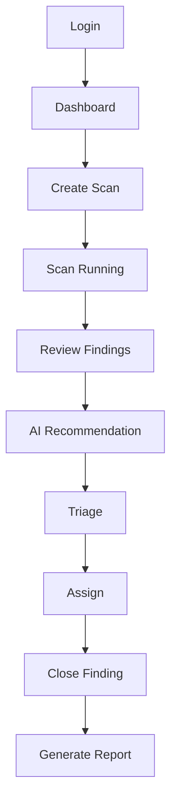
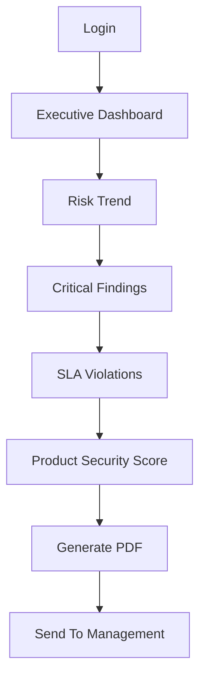
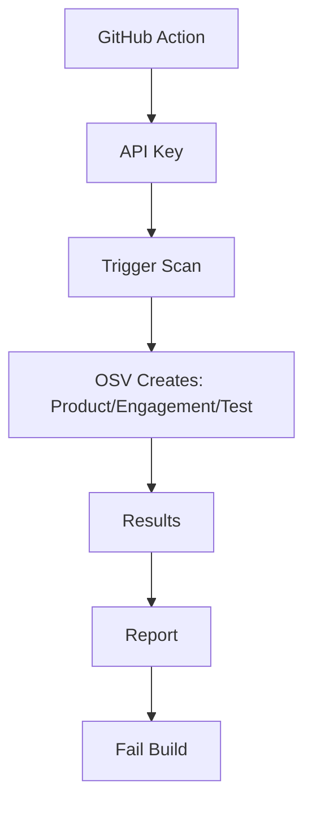

# OSV Platform — Sitemap & Wireframes

Rất tốt. Với PRD/URD/SRS hiện tại, tôi sẽ thiết kế theo hướng **Enterprise Cybersecurity Platform (Wiz + DefectDojo + Tenable + CrowdStrike)** thay vì dashboard đơn lẻ.

---

## 1. INFORMATION ARCHITECTURE (SITE MAP)

```text
OSV PLATFORM
│
├── Dashboard
│   ├── Executive Overview
│   ├── Risk Overview
│   ├── Security Posture
│   └── SLA Dashboard
│
├── Vulnerability Intelligence
│   ├── CVE Search
│   ├── Semantic Search
│   ├── Vendor Catalog
│   ├── Product Catalog
│   ├── KEV Catalog
│   ├── EPSS Analytics
│   ├── CWE Catalog
│   ├── CAPEC Catalog
│   ├── CVE Feeds
│   └── Export Center
│
├── Active Scanning
│   ├── Scan Dashboard
│   ├── New Scan Wizard
│   ├── Running Scans
│   ├── Scheduled Scans
│   ├── Scan History
│   ├── Nmap Results
│   ├── ZAP Results
│   └── Agent Results
│
├── Findings
│   ├── All Findings
│   ├── Active Findings
│   ├── Mitigated
│   ├── False Positive
│   ├── Risk Accepted
│   ├── Duplicates
│   ├── Audit Trail
│   └── Bulk Actions
│
├── Assets
│   ├── Asset Inventory
│   ├── Asset Groups
│   ├── Asset Detail
│   ├── Asset Timeline
│   └── Tags Management
│
├── Product Security
│   ├── Product Types
│   ├── Products
│   ├── Engagements
│   ├── Tests
│   ├── Security Scorecards
│   └── Product Grades
│
├── AI Center
│   ├── AI Triage Queue
│   ├── AI Findings Review
│   ├── Semantic Similarity
│   ├── CVE Enrichment
│   └── AI Insights
│
├── Reports
│   ├── Executive Reports
│   ├── Technical Reports
│   ├── Compliance Reports
│   ├── Report Templates
│   ├── Generated Reports
│   └── Scheduled Reports
│
├── Notifications
│   ├── Inbox
│   ├── SLA Alerts
│   ├── KEV Alerts
│   ├── Scan Alerts
│   └── Webhook Events
│
├── Integrations
│   ├── API Keys
│   ├── Webhooks
│   ├── Jira
│   ├── Slack
│   ├── Teams
│   ├── OAuth
│   └── LDAP
│
└── Administration
    ├── Users
    ├── Roles
    ├── Permissions
    ├── MFA
    ├── Audit Logs
    ├── System Settings
    ├── Scan Engines
    └── License
```

---

## 2. GLOBAL APPLICATION LAYOUT

Mọi màn hình đều dùng cùng layout.

```text
┌───────────────────────────────────────────────────────────────┐
│ LOGO │ Search Everything... │ Notifications │ User Menu      │
├──────┬────────────────────────────────────────────────────────┤
│      │ Breadcrumbs                                    Actions │
│      ├────────────────────────────────────────────────────────┤
│      │                                                │
│ SID  │                                                │
│ EBAR │               MAIN CONTENT                     │
│      │                                                │
│      │                                                │
│      └────────────────────────────────────────────────────────┘
└───────────────────────────────────────────────────────────────┘
```

---

## 3. USER FLOWS

### 3.1. Security Analyst (Persona: Bob)

**Mục tiêu:** Quản lý lỗ hổng.



#### Flow 1 - Network Scan
```text
Dashboard → Create Scan → Choose Scan Type (NMAP) → Targets (10.0.0.0/24) → Review → Start Scan → Running → Scan Completed → Findings Generated → Finding Detail → Mitigate
```

### 3.2. CISO (Persona: Carol)

**Mục tiêu:** Báo cáo, đánh giá tổng quan.



### 3.3. DevSecOps (Persona: Alice)

**Mục tiêu:** Tự động hoá quét mã.



---

## 4. WIREFRAMES

### 4.1. Dashboard

```text
┌────────────────────────────────────────────┐
│ Executive Security Dashboard               │
├────────────────────────────────────────────┤
│ ┌────────┐ ┌────────┐ ┌────────┐ ┌────────┐│
│ │  245   │ │ 1250   │ │  98%   │ │  A-    ││
│ │Critical│ │ Assets │ │SLA Comp│ │ Grade  ││
│ └────────┘ └────────┘ └────────┘ └────────┘│
├────────────────────────────────────────────┤
│ Risk Trend Chart                           │
├────────────────────────────────────────────┤
│ Severity Distribution: Critical|High|Med|Low│
├────────────────────────────────────────────┤
│ Recent Critical Findings Table             │
└────────────────────────────────────────────┘
```

### 4.2. CVE Search

```text
┌────────────────────────────────────────────┐
│ Search CVEs                                │
├──────────────┬─────────────────────────────┤
│ Filters      │ CVE Table                   │
│ - Severity   │ CVE ID | CVSS | EPSS | KEV  │
│ - EPSS       │ Vendor | Updated            │
│ - KEV        ├─────────────────────────────┤
│ - Vendor     │ Click CVE -> Side Drawer    │
│ - Product    │ Description | Affected      │
│ - CWE        │ CVSS | EPSS | CAPEC | CWE   │
└──────────────┴─────────────────────────────┘
```

### 4.3. Scan Wizard

- **Step 1:** Choose Scan Type: `[ NMAP ]` `[ ZAP ]` `[ AGENT ]`
- **Step 2:** Targets: `10.10.10.0/24` or `https://app.company.com`
- **Step 3:** Options: `[✓] Service Detection` `[✓] OS Detection` `[✓] Vulners Script`, Timeout, Concurrency
- **Step 4:** Review: Target, Type, Duration, Risk -> `Start Scan`

### 4.4. Realtime Scan

```text
Running Scan | Status: Running | Duration: 03:25
──────────────────────
Host Discovery          ██████████░░░░ 80%
Port Scanning           ██████░░░░░░░  50%
Vulnerability Detection ██░░░░░░░░░░░  15%
──────────────────────
Logs:
10.0.0.1 discovered
Port 443 open...
```

### 4.5. Finding Detail (Quan trọng nhất)

```text
Finding: CVE-2025-12345 | Critical
────────────────────────
Overview: CVSS 9.8 | EPSS 98% | KEV Yes
────────────────────────
Affected Asset: 10.0.0.5 | WebServer01
────────────────────────
Evidence: Nmap Output | ZAP Evidence
────────────────────────
AI Analysis: Confirmed | Confidence 95% | Reasoning
────────────────────────
Audit Trail
────────────────────────
Actions: Mitigate | False Positive | Accept Risk | Reopen
```

### 4.6. Asset Detail

```text
Asset Profile: 10.0.0.5 | Linux Ubuntu 22.04
────────────────────
Risk Score: 9.8
────────────────────
Open Ports: 22, 80, 443
────────────────────
Services: Nginx, SSH
────────────────────
Historical Scans | Related Findings
```

### 4.7. Product Security

```text
Products > Applications
 ├─ Banking App (Selected)
 ├─ Mobile App
 └─ API Gateway
────────────────────
Selected Product: Banking App | Grade B
Critical 0 | High 4 | Medium 15 | Low 44
────────────────────
Engagements | Tests | Findings
```

### 4.8. Report Generation

```text
Generate Report
Type: (*) Executive ( ) Technical ( ) Compliance
────────────────────
Filters: Severity | Date | Product
────────────────────
Preview
────────────────────
Generate PDF | Generate HTML | Generate Excel
```

---

## 5. COMPONENT LIBRARY CHO FIGMA

Tạo trước các component sau để tái sử dụng:

- **Navigation:** Sidebar, Topbar, Breadcrumb
- **Cards:** KPI Card, Risk Card, Alert Card, Grade Card
- **Tables:** CVE Table, Finding Table, Asset Table, Scan Table
- **Charts:** Severity Donut, Risk Trend, EPSS Trend, SLA Trend
- **Forms:** Scan Wizard, Report Wizard, Product Wizard
- **Drawers:** CVE Detail Drawer, Finding Drawer, Asset Drawer
- **Modals:** Create Scan, Accept Risk, Close Finding, Generate Report

---

## 6. CẤU TRÚC FRAME TRONG FIGMA

```text
01_Design_System
02_Login
03_Dashboard
04_CVE_Intelligence (Search, Detail, Vendor, KEV)
05_Scanning (Wizard, Running, Results)
06_Findings (List, Detail)
07_Assets (Inventory, Detail)
08_ProductSecurity (Products, Engagements)
09_AI_Center
10_Reports
11_Admin
```

> Với bộ SRS hiện tại, sản phẩm hoàn chỉnh sẽ cần khoảng **28–35 màn hình high-fidelity**, đủ để Figma Make hoặc AI UI Generator tạo thành một MVP gần sát sản phẩm thực tế.