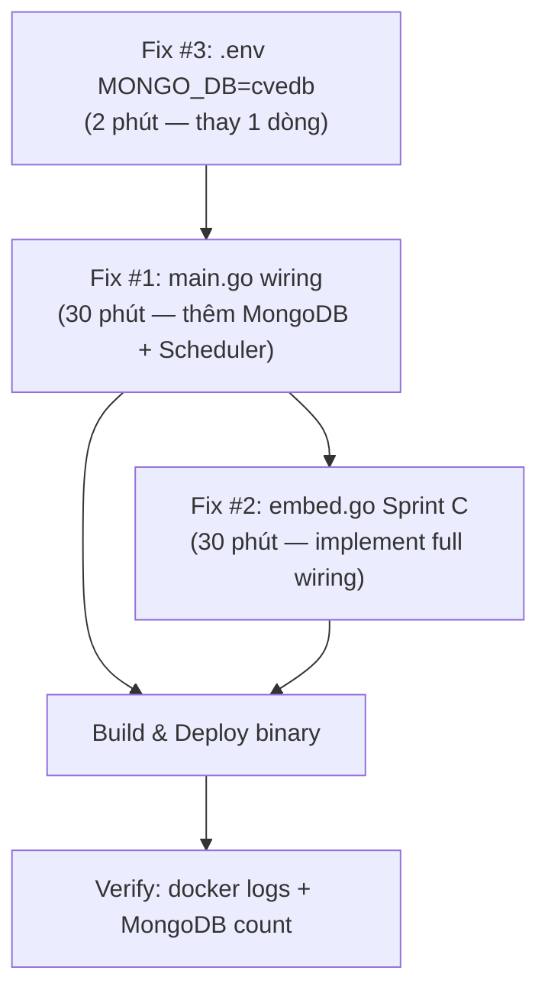

# FIX PLAN — F02 CVE Data Aggregation: Scheduler không hoạt động

> **Version:** 1.0  
> **Ngày:** 2026-06-18  
> **Tham chiếu kiến trúc:** [01-architecture.md](../../01-architecture.md) Section 3.2, [02-technical-design.md](../../02-technical-design.md) Section 4.1  
> **Bugs được giải quyết:** BUG-001, BUG-002, BUG-003

---

## Phân tích nguyên nhân gốc

Hệ thống có **2 entry point** có thể chạy data-service:

| Entry Point | File | Trạng thái |
|-------------|------|-----------|
| **Standalone** | `services/data-service/cmd/server/main.go` | ❌ Không có scheduler wiring |
| **Unified binary** | `apps/osv/cmd/osv/main.go` → `wire.go` → `embed.go` | ❌ Placeholder, "Sprint C" chưa implement |

Trên server `172.20.2.48`, binary `osv-server` được build từ `apps/osv`, nên cả 2 paths đều cần fix. Tuy nhiên, **Fix #1 (standalone main.go)** là ưu tiên cao nhất vì `data-service/server` binary cũng được sử dụng độc lập.

---

## Fix #1 — Wire Scheduler vào `services/data-service/cmd/server/main.go`

### Mức độ thay đổi: Medium
### Ảnh hưởng: data-service standalone binary

### Nguyên lý (theo Clean Architecture)

```
main.go (Infrastructure wiring)
  │
  ├── infra: Connect MongoDB, NATS
  ├── fetcher: Build Registry, Register all fetchers
  ├── usecase/sync: Init KEV SyncUseCase  
  └── delivery/scheduler: NewWithRegistry → Start()
```

### Code thay đổi

**File:** `services/data-service/cmd/server/main.go`

Thêm MongoDB + NATS init, build registry, khởi động scheduler:

```go
package main

import (
    "context"
    "fmt"
    "net"
    "net/http"
    "os"
    "os/signal"
    "syscall"
    "time"

    "github.com/osv/shared/pkg/observability"
    "go.mongodb.org/mongo-driver/mongo"
    mongoopts "go.mongodb.org/mongo-driver/mongo/options"
    "google.golang.org/grpc"
    "google.golang.org/grpc/health"
    healthpb "google.golang.org/grpc/health/grpc_health_v1"
    "github.com/rs/zerolog"

    // Internal packages — data-service
    "github.com/osv/data-service/internal/fetcher"
    "github.com/osv/data-service/internal/delivery/scheduler"
    "github.com/osv/data-service/internal/usecase/sync"
    mongoinfra "github.com/osv/data-service/internal/infra/mongo"
    natsinfra "github.com/osv/data-service/internal/infra/messaging/nats"
)

func main() {
    log := observability.InitLogger("data-service", "1.0.0")

    ctx, cancel := signal.NotifyContext(context.Background(), os.Interrupt, syscall.SIGTERM)
    defer cancel()

    metrics := observability.NewCommonMetrics("data-service")
    observability.StartMetricsServer(9092)

    shutdown, err := observability.InitTracer(ctx, "data-service", "1.0.0")
    if err != nil {
        log.Warn().Err(err).Msg("tracing init failed, continuing without tracing")
    }
    defer shutdown()

    grpcPort := envOr("DATA_GRPC_PORT", envOr("GRPC_PORT", "50053"))
    httpPort := envOr("DATA_HTTP_PORT", envOr("HTTP_PORT", "8082"))

    // ── Step 1: Connect MongoDB ──────────────────────────────────────────────
    mongoURI := envOr("MONGO_URI", "mongodb://localhost:27017")
    mongoDB  := envOr("MONGO_DB", "cvedb")
    
    mongoClient, err := mongo.Connect(ctx,
        mongoopts.Client().ApplyURI(mongoURI).SetServerSelectionTimeout(10*time.Second),
    )
    if err != nil {
        log.Fatal().Err(err).Str("uri", mongoURI).Msg("failed to connect MongoDB")
    }
    defer mongoClient.Disconnect(context.Background()) //nolint:errcheck
    
    if err := mongoClient.Ping(ctx, nil); err != nil {
        log.Fatal().Err(err).Msg("MongoDB ping failed")
    }
    db := mongoClient.Database(mongoDB)
    log.Info().Str("db", mongoDB).Msg("MongoDB connected")

    // ── Step 2: Connect NATS (optional — graceful degradation) ────────────────
    natsURL     := envOr("NATS_URL", "nats://localhost:4222")
    natsEnabled := envOr("NATS_ENABLED", "true") == "true"
    
    var cvePublisher *natsinfra.CVEEventPublisher
    if natsEnabled {
        pub, err := natsinfra.NewCVEEventPublisher(natsURL)
        if err != nil {
            log.Warn().Err(err).Str("url", natsURL).Msg("NATS connection failed — continuing without NATS")
        } else {
            cvePublisher = pub
            log.Info().Str("url", natsURL).Msg("NATS connected")
        }
    }

    // ── Step 3: Build Fetcher Registry ───────────────────────────────────────
    nvdAPIKey  := envOr("NVD_API_KEY", "")
    
    reg := fetcher.NewRegistry()
    
    // Core CVE fetchers
    nvdFetcher := fetcher.NewNVDCVEFetcher(db, nvdAPIKey, 2002)
    reg.Register(fetcher.WithCVEPublisher(nvdFetcher, cvePublisher, log))
    
    reg.Register(fetcher.NewCIRCLFetcher(db))
    reg.Register(fetcher.NewJVNFetcher(db))
    reg.Register(fetcher.NewExploitDBFetcher(db))
    reg.Register(fetcher.NewCVEOrgFetcher(db))
    
    // Enrichment fetchers
    reg.Register(fetcher.NewEPSSFetcher(db))
    reg.Register(fetcher.NewMITRECAPECFetcher(db))
    reg.Register(fetcher.NewMITRECWEFetcher(db))
    reg.Register(fetcher.NewNVDCPEFetcher(db, nvdAPIKey))
    
    log.Info().Strs("fetchers", reg.Names()).Msg("Fetcher registry initialized")

    // ── Step 4: Init KEV Sync UseCase ────────────────────────────────────────
    kevRepo := mongoinfra.NewKEVRepository(db)
    var kevPublisher *natsinfra.KEVEventPublisher
    if cvePublisher != nil {
        kevPublisher, _ = natsinfra.NewKEVEventPublisher(natsURL)
    }
    syncUC := sync.NewUseCase(kevRepo, kevPublisher, log)

    // ── Step 5: Start Scheduler ──────────────────────────────────────────────
    sched := scheduler.NewWithRegistry(syncUC, reg, log)
    sched.Start()
    defer sched.Stop()
    
    log.Info().Msg("Scheduler started — all fetchers are scheduled")

    // ── Step 6: Trigger immediate startup sync (optional) ────────────────────
    // Chạy ngay sau khi start để không phải đợi đến interval đầu tiên
    startupSync := envOr("STARTUP_SYNC_ENABLED", "true") == "true"
    if startupSync {
        log.Info().Msg("Triggering startup KEV sync")
        sched.RunNow() // KEV sync ngay lập tức
        
        // NVD incremental: 2 ngày gần nhất  
        go sched.RunSourceNow(fetcher.SourceNVD.String(), 2)
    }

    // ── gRPC Server ──────────────────────────────────────────────────────────
    lis, err := net.Listen("tcp", ":"+grpcPort)
    if err != nil {
        log.Fatal().Err(err).Msg("failed to listen gRPC")
    }

    s := grpc.NewServer()
    healthSvc := health.NewServer()
    healthpb.RegisterHealthServer(s, healthSvc)
    healthSvc.SetServingStatus("", healthpb.HealthCheckResponse_SERVING)

    log.Info().
        Str("grpc_port", grpcPort).
        Str("http_port", httpPort).
        Msg("data-service starting")

    go func() {
        if err := s.Serve(lis); err != nil {
            log.Fatal().Err(err).Msg("gRPC serve failed")
        }
    }()

    // ── HTTP Server (health + admin endpoints) ────────────────────────────────
    mux := http.NewServeMux()
    mux.HandleFunc("/health", func(w http.ResponseWriter, _ *http.Request) {
        w.Header().Set("Content-Type", "application/json")
        w.WriteHeader(http.StatusOK)
        fmt.Fprintf(w, `{"status":"ok","service":"data-service","fetchers":%d}`,
            reg.Len()) //nolint:errcheck
    })
    
    // Admin: trigger manual sync
    mux.HandleFunc("/admin/sync/", func(w http.ResponseWriter, r *http.Request) {
        if r.Method != http.MethodPost {
            http.Error(w, "method not allowed", http.StatusMethodNotAllowed)
            return
        }
        // Extract source from path: /admin/sync/{source}
        source := r.URL.Path[len("/admin/sync/"):]
        manualDays := 7 // default: last 7 days
        
        if source == "kev" || source == "KEV" {
            sched.RunNow()
        } else {
            sched.RunSourceNow(source, manualDays)
        }
        
        w.Header().Set("Content-Type", "application/json")
        fmt.Fprintf(w, `{"status":"triggered","source":%q,"manual_days":%d}`,
            source, manualDays) //nolint:errcheck
    })

    handler := observability.LoggingMiddleware(log)(observability.MetricsMiddleware(metrics)(mux))
    httpSrv := &http.Server{Addr: ":" + httpPort, Handler: handler}
    go func() {
        if err := httpSrv.ListenAndServe(); err != nil && err != http.ErrServerClosed {
            log.Fatal().Err(err).Msg("HTTP serve failed")
        }
    }()

    <-ctx.Done()
    log.Info().Msg("shutting down data-service")
    s.GracefulStop()
    httpSrv.Shutdown(context.Background()) //nolint:errcheck
}

func envOr(key, def string) string {
    if v := os.Getenv(key); v != "" {
        return v
    }
    return def
}
```

### Biến môi trường cần thêm vào `.env`

```bash
# NVD API Key (tùy chọn — không có thì rate limit 6.5s/request)
NVD_API_KEY=

# Startup sync (chạy fetch ngay khi service khởi động)
STARTUP_SYNC_ENABLED=true
```

---

## Fix #2 — Wire Scheduler trong `apps/osv` (Unified Binary)

### Mức độ thay đổi: Medium
### Ảnh hưởng: Unified binary `apps/osv` trên server

### Thay đổi file `services/data-service/cmd/server/embed.go`

Implement "Sprint C" — thay `runEmbeddedDataService` placeholder bằng wiring thực:

```go
// embed.go — Implement Sprint C: full data-service wiring for embedded mode
package main

import (
    "context"
    "fmt"
    "net"
    "net/http"
    "os"
    "time"

    "github.com/rs/zerolog"
    "go.mongodb.org/mongo-driver/mongo"
    mongoopts "go.mongodb.org/mongo-driver/mongo/options"

    "github.com/osv/data-service/internal/fetcher"
    "github.com/osv/data-service/internal/delivery/scheduler"
    "github.com/osv/data-service/internal/usecase/sync"
    mongoinfra "github.com/osv/data-service/internal/infra/mongo"
    natsinfra "github.com/osv/data-service/internal/infra/messaging/nats"
)

// DataServiceEmbeddedConfig holds configuration for embedded data-service.
type DataServiceEmbeddedConfig struct {
    HTTPPort    int
    GRPCPort    int
    NATSURL     string
    MongoURI    string
    MongoDB     string
    NVDAPIKey   string
    PostgresDSN string // kept for forward-compat (alias groups)
}

// DataServiceEmbeddedServer wraps data-service for embedding in apps/osv.
type DataServiceEmbeddedServer struct {
    cfg DataServiceEmbeddedConfig
}

// NewDataServiceEmbeddedServer creates a new embeddable server instance.
func NewDataServiceEmbeddedServer(cfg DataServiceEmbeddedConfig) *DataServiceEmbeddedServer {
    return &DataServiceEmbeddedServer{cfg: cfg}
}

func (s *DataServiceEmbeddedServer) Name() string { return "data-service" }

// Start begins serving — connects MongoDB, builds fetcher registry, starts scheduler.
// Implements "Sprint C" full data-service wiring for embedded mode.
func (s *DataServiceEmbeddedServer) Start(ctx context.Context) error {
    log := zerolog.New(os.Stderr).With().
        Timestamp().
        Str("service", "data-service").
        Logger()

    cfg := s.cfg

    // ── Connect MongoDB ──────────────────────────────────────────────────────
    mongoURI := cfg.MongoURI
    if mongoURI == "" {
        mongoURI = os.Getenv("MONGO_URI")
        if mongoURI == "" {
            mongoURI = "mongodb://localhost:27017"
        }
    }
    mongoDB := cfg.MongoDB
    if mongoDB == "" {
        mongoDB = os.Getenv("MONGO_DB")
        if mongoDB == "" {
            mongoDB = "cvedb"
        }
    }

    mongoClient, err := mongo.Connect(ctx,
        mongoopts.Client().ApplyURI(mongoURI).SetServerSelectionTimeout(10*time.Second),
    )
    if err != nil {
        return fmt.Errorf("data-service: MongoDB connect: %w", err)
    }
    defer mongoClient.Disconnect(context.Background()) //nolint:errcheck

    if err := mongoClient.Ping(ctx, nil); err != nil {
        return fmt.Errorf("data-service: MongoDB ping: %w", err)
    }
    db := mongoClient.Database(mongoDB)
    log.Info().Str("db", mongoDB).Msg("MongoDB connected")

    // ── Connect NATS (optional) ──────────────────────────────────────────────
    natsURL := cfg.NATSURL
    if natsURL == "" {
        natsURL = os.Getenv("NATS_URL")
    }
    var cvePublisher *natsinfra.CVEEventPublisher
    if natsURL != "" && os.Getenv("NATS_ENABLED") != "false" {
        pub, err := natsinfra.NewCVEEventPublisher(natsURL)
        if err != nil {
            log.Warn().Err(err).Msg("NATS unavailable — running without event publishing")
        } else {
            cvePublisher = pub
            log.Info().Msg("NATS connected")
        }
    }

    // ── Build Fetcher Registry ────────────────────────────────────────────────
    nvdAPIKey := cfg.NVDAPIKey
    if nvdAPIKey == "" {
        nvdAPIKey = os.Getenv("NVD_API_KEY")
    }

    reg := fetcher.NewRegistry()
    reg.Register(fetcher.WithCVEPublisher(
        fetcher.NewNVDCVEFetcher(db, nvdAPIKey, 2002),
        cvePublisher, log,
    ))
    reg.Register(fetcher.NewCIRCLFetcher(db))
    reg.Register(fetcher.NewJVNFetcher(db))
    reg.Register(fetcher.NewExploitDBFetcher(db))
    reg.Register(fetcher.NewCVEOrgFetcher(db))
    reg.Register(fetcher.NewEPSSFetcher(db))
    reg.Register(fetcher.NewMITRECAPECFetcher(db))
    reg.Register(fetcher.NewMITRECWEFetcher(db))
    reg.Register(fetcher.NewNVDCPEFetcher(db, nvdAPIKey))

    log.Info().Strs("fetchers", reg.Names()).Msg("Fetcher registry initialized")

    // ── Init KEV SyncUseCase ─────────────────────────────────────────────────
    kevRepo := mongoinfra.NewKEVRepository(db)
    var kevPublisher *natsinfra.KEVEventPublisher
    if cvePublisher != nil {
        kevPublisher, _ = natsinfra.NewKEVEventPublisher(natsURL)
    }
    syncUC := sync.NewUseCase(kevRepo, kevPublisher, log)

    // ── Start Scheduler ──────────────────────────────────────────────────────
    sched := scheduler.NewWithRegistry(syncUC, reg, log)
    sched.Start()
    defer sched.Stop()
    log.Info().Msg("Scheduler started")

    // Startup sync: run immediately after boot
    if os.Getenv("STARTUP_SYNC_ENABLED") != "false" {
        sched.RunNow()                                      // KEV sync
        go sched.RunSourceNow(fetcher.SourceNVD.String(), 2) // NVD: last 2 days
    }

    // ── HTTP Health Server ────────────────────────────────────────────────────
    port := cfg.HTTPPort
    if port == 0 {
        port = 8082
    }

    mux := http.NewServeMux()
    mux.HandleFunc("/health", func(w http.ResponseWriter, r *http.Request) {
        w.Header().Set("Content-Type", "application/json")
        fmt.Fprintf(w, `{"status":"ok","service":"data-service","fetchers":%d}`, reg.Len())
    })
    mux.HandleFunc("/admin/sync/", func(w http.ResponseWriter, r *http.Request) {
        if r.Method != http.MethodPost {
            http.Error(w, "method not allowed", http.StatusMethodNotAllowed)
            return
        }
        source := r.URL.Path[len("/admin/sync/"):]
        if source == "kev" {
            sched.RunNow()
        } else {
            sched.RunSourceNow(source, 7)
        }
        fmt.Fprintf(w, `{"triggered":%q}`, source)
    })

    ln, err := net.Listen("tcp", fmt.Sprintf(":%d", port))
    if err != nil {
        return fmt.Errorf("data-service listen :%d: %w", port, err)
    }

    srv := &http.Server{Handler: mux}
    go srv.Serve(ln) //nolint:errcheck

    <-ctx.Done()
    return srv.Close()
}
```

### Thay đổi `wire.go` — dùng DataServiceEmbeddedServer thực

Thay thế placeholder bằng embedded server có đầy đủ wiring:

```go
// Thay đổi trong apps/osv/internal/config/wire.go

// ── Data Service (FULL wiring — Sprint C) ───────────────────────────────
// Thay thế: dataSvc := adapters.NewEmbeddedService("data-service", 8082)
// Bằng:

import dataservice "github.com/osv/data-service/cmd/server"

dataSvc := dataservice.NewDataServiceEmbeddedServer(dataservice.DataServiceEmbeddedConfig{
    HTTPPort:  8082,
    GRPCPort:  50053,
    NATSURL:   cfg.Services.NATSURL,
    MongoURI:  os.Getenv("MONGO_URI"),
    MongoDB:   os.Getenv("MONGO_DB"),
    NVDAPIKey: os.Getenv("NVD_API_KEY"),
})
```

---

## Fix #3 — Đồng nhất MONGO_DB

**File:** `deploy/dev/.env`

```diff
- MONGO_DB=osv
+ MONGO_DB=cvedb
```

**Lý do chọn `cvedb`:**
- Là default trong `docker-compose.yml` — tránh override phức tạp
- Tên mô tả đúng mục đích (CVE database)
- Tránh nhầm với PostgreSQL DB `osv`

---

## Thứ tự triển khai Fix



**Ưu tiên:**
1. 🔴 Fix #3 (2 phút) — không breaking, ngay lập tức
2. 🔴 Fix #1 hoặc Fix #2 — tùy vào binary nào đang chạy trên server

---

## Verification sau khi fix

### Test thủ công

```bash
# 1. Kiểm tra scheduler log
docker logs <osv-container> 2>&1 | grep -E "Scheduler started|Source sync|fetcher"
# Expected:
# {"level":"info","component":"scheduler","message":"Scheduler started (KEV: 6h, sources: registered map)"}
# {"level":"info","source":"NVD","message":"Source sync started"}

# 2. Trigger manual sync để test ngay (không cần đợi schedule)
curl -X POST http://localhost:8082/admin/sync/NVD?days=1
# Expected: {"triggered":"NVD"}

# 3. Sau ~5 phút, kiểm tra MongoDB
docker exec <mongodb-container> mongosh --eval \
  "db = db.getSiblingDB('cvedb'); print('CVEs:', db.cves.countDocuments())"
# Expected: CVEs: >0 (thường 1000+ sau 1 ngày)

# 4. Kiểm tra KEV
curl -X POST http://localhost:8082/admin/sync/kev
docker exec <mongodb-container> mongosh --eval \
  "db = db.getSiblingDB('cvedb'); print('KEV entries:', db.kev.countDocuments())"
# Expected: KEV entries: 1000+ (CISA KEV có ~1200 entries)

# 5. Health check với fetcher count
curl http://localhost:8082/health
# Expected: {"status":"ok","service":"data-service","fetchers":9}
```

### Expected MongoDB sau 24h

| Collection | Documents | Nguồn |
|-----------|-----------|-------|
| `cves` | ~250,000+ | NVD, CIRCL, JVN, CVE.org |
| `kev` | ~1,200+ | CISA KEV |
| `capec` | ~500+ | MITRE CAPEC |
| `cwe` | ~1,000+ | MITRE CWE |
| `cpe` | ~1,000,000+ | NVD CPE (chạy mỗi Sunday) |

---

## Rủi ro và Mitigation

| Rủi ro | Khả năng | Mitigation |
|--------|----------|-----------|
| NVD API rate limit (429) | Cao nếu không có API key | Set `NVD_API_KEY` trong `.env` |
| MongoDB disk space (CPE ~1M docs) | Trung bình | Cần ~2GB free disk cho CPE full import |
| NATS connection fail khi start | Thấp | Graceful degradation — tiếp tục không có NATS |
| MongoDB timeout khi startup | Thấp | SetServerSelectionTimeout(10s) — service không crash |
| Scheduler chiếm CPU khi full import | Trung bình | Full import chỉ chạy 1 lần; incremental update nhẹ |

---

## Tham chiếu

- [Fetcher Registry Pattern](../../01-architecture.md#32-data-service-servicesdata-service) — Architecture Doc Section 3.2
- [FetchScheduler Design](../../02-technical-design.md#41-fetcher-registry--scheduler) — TDD Section 4.1
- [Execution Flow F02](../features/f02-cve-data-aggregation/execution-flow.md) — F02 Spec
- [NVD CVE Fetcher](../../../services/data-service/internal/fetcher/nvd_cve.go)
- [Scheduler Implementation](../../../services/data-service/internal/delivery/scheduler/scheduler.go)
- [Publisher Hook](../../../services/data-service/internal/fetcher/publisher_hook.go)
